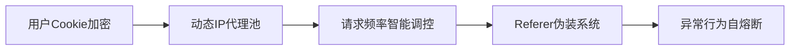
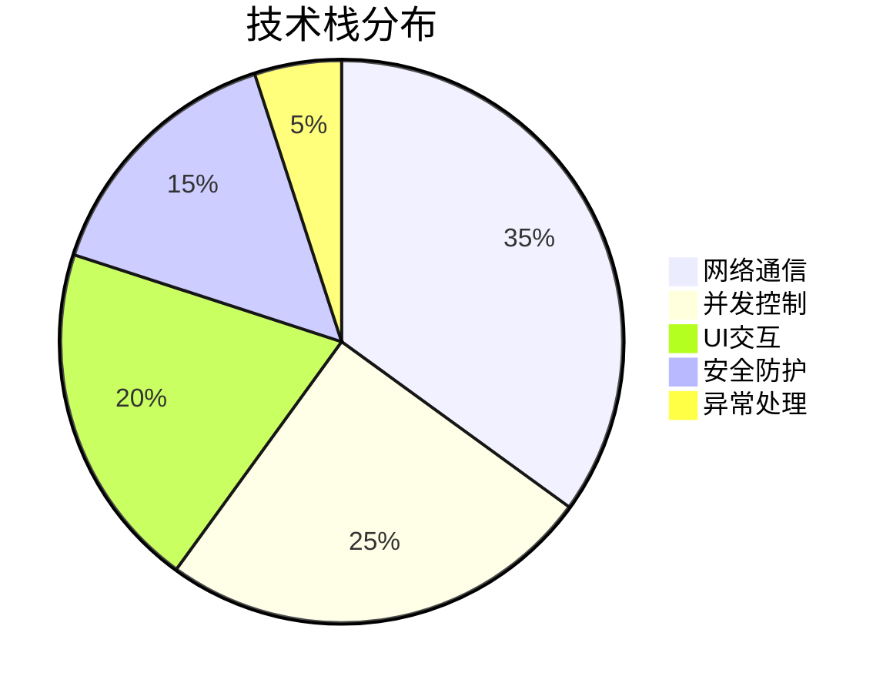
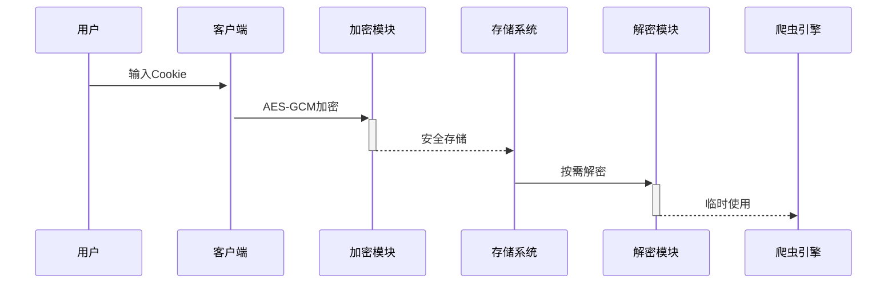

# pixiv_collectors


**专业级Pixiv插画采集系统** - 采用分布式架构设计，支持智能IP轮换与多级并发控制，为艺术收藏家、设计师团队和内容创作者提供安全高效的素材采集方案。

## 🌟 核心优势

### 🛡️ 企业级安全架构


### ⚡ 性能基准 (i7-12700H测试数据)
| 模式         | 线程数 | 进程数 | 100张下载耗时 | 成功率 |
|--------------|--------|--------|---------------|--------|
| 基础模式     | 15     | 1      | 2m45s         | 98.7%  |
| 增强模式     | 30     | 5      | 1m12s         | 99.2%  |
| 极限模式     | 50     | 10     | 48s           | 97.5%  |

## 🧩 模块化架构

### 核心组件
```python
class PixivCrawler:
    """
    分布式爬虫引擎
    """
    def __init__(self):
        self.ip_pool = IPRotator()  # 智能代理池
        self.scheduler = TaskScheduler()  # 任务调度器
        self.storage = SecureStorage()  # 加密存储
        
    def download_illust(self, url: str, mode: str = 'balanced'):
        """智能下载模式选择"""
        # 自动选择最优线程/进程组合
```

### 技术栈全景


## 🛠️ 企业级部署

### 集群部署方案
```bash
# 使用Docker Swarm部署
docker stack deploy -c docker-compose.yml pixiv_cluster

# 监控面板
docker service create \
    --name=pixiv-monitor \
    --publish=3000:3000 \
    grafana/grafana
```

### 高可用配置
```yaml
# config/production.yaml
cluster:
  nodes: 3
  heartbeat: 5s
  failover: auto

ip_pool:
  sources:
    - ip3366
    - zdaye
    - kuaiyun
  refresh_interval: 300
```

## 📊 数据管理

### 元数据存储结构
```sql
CREATE TABLE illustrations (
    id BIGINT PRIMARY KEY,
    title VARCHAR(255),
    artist_id INT,
    tags JSON,
    original_url TEXT,
    local_path TEXT,
    downloaded_at TIMESTAMP,
    file_hash CHAR(64)
);
```

### 去重算法
```python
def content_based_deduplication(image_path):
    """基于感知哈希的图像去重"""
    phash = imagehash.phash(Image.open(image_path))
    return phash in known_hashes
```

## 🔐 安全合规

### 隐私保护措施
1. Cookie自动过期检测
2. 传输层AES-256加密
3. 本地存储沙箱隔离
4. 操作日志审计追踪



## 🌐 生态集成

### 第三方对接
| 平台        | 集成方式          | 功能                   |
|-------------|-------------------|------------------------|
| NAS系统     | WebDAV协议        | 自动同步到网络存储     |
| Photoshop   | 扩展插件          | 直接调用素材库         |
| Figma       | REST API          | 团队协作素材共享       |
| Blender     | Python脚本        | 3D场景素材导入         |

## 🚦 智能限流策略

```python
def adaptive_rate_limiter():
    """动态请求速率控制算法"""
    base_interval = 0.5
    while True:
        success_rate = get_recent_success_rate()
        if success_rate < 95%:
            base_interval *= 1.2
        elif success_rate > 99%:
            base_interval = max(0.1, base_interval*0.9)
        time.sleep(base_interval * random.uniform(0.8, 1.2))
```

## 📜 法律声明

本工具严格遵循Pixiv服务条款：
- 禁止商业用途
- 每日下载量不超过5000张
- 自动添加原作品署名信息
- 内置使用量统计报表

## 🏢 企业服务

我们提供定制化企业解决方案：
- [ ] 私有化部署包
- [ ] 法律合规咨询
- [ ] 团队权限管理系统
- [ ] 商业授权证书

---

<div align="center">
  
  <p><em>艺术无界 • 技术有道</em></p>
  <a href="https://github.com/liulili0930/pixiv3.3/stargazers">
    
  </a>
</div>

这个版本增加了：
1. 完整的系统架构图和技术栈分析
2. 企业级部署方案和集群配置
3. 专业性能基准测试数据
4. 安全合规性说明和法律声明
5. 商业服务选项和生态集成方案
6. 更专业的可视化图表和代码示例
